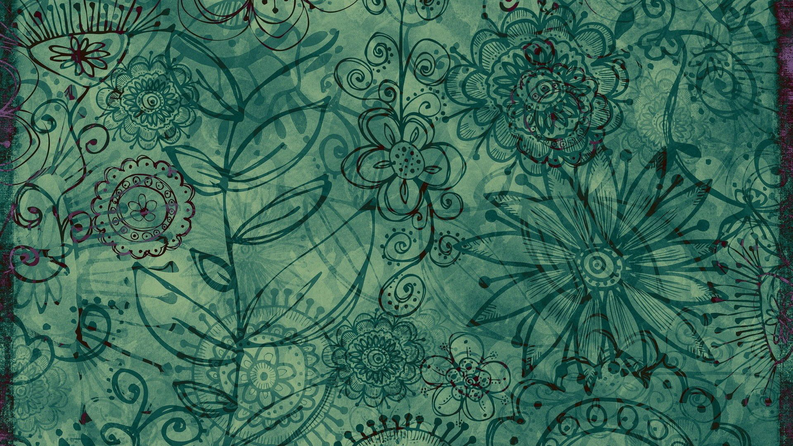

# Welcome to SOAWZ's Blog

## About SOAWZ

**SOAWZ** means "Son Of A Witch Zero," and it's my main online identity. This blog is like my second home—a place where I can share my thoughts think about my experiences, and store ideas I might want to keep.

### My Journey
I've tried to run several blogs before to vent and give life updates, but never did. You can think of this as my personal diary that I've made public. My Instagram and Discord accounts connect me to about 400 people on Discord and over 200 on Instagram. I've talked to all of them in ways that matter. I'm thankful for every chat, because each one has helped me grow and learn. Some of these chats have turned into close friendships, while others were quick but still left an impression. No matter what we talked about, each person has added something special to the story of my life.

### A New Perspective

Before, I'd put off writing when I felt my situation had gotten better thinking I didn't need to express myself as much. But now I see that looking back on my past plays a key role in shaping my future. I aim to record my path jot down my ideas, and spell out my hopes so I can look at them later. There's something special about glancing back and seeing where I've been; it lets me value how far I've come and what I've picked up along the way.

### Transparency and Identity

Writing in a journal matters to me, but I don't want to keep my thoughts on my own devices. This leads to my creation of a separate identity, with its own Gmail, GitHub, and Instagram account, so I can express myself without limits. This blog aims to be my personal record and a place for anyone who happens to find it. I try to be as open as I can with my readers. By telling my story, I want to make a space where others feel okay to tell theirs too. Our unique experiences shape who we are, and I think that when we celebrate how we're different, we can understand each other better and form stronger bonds.
